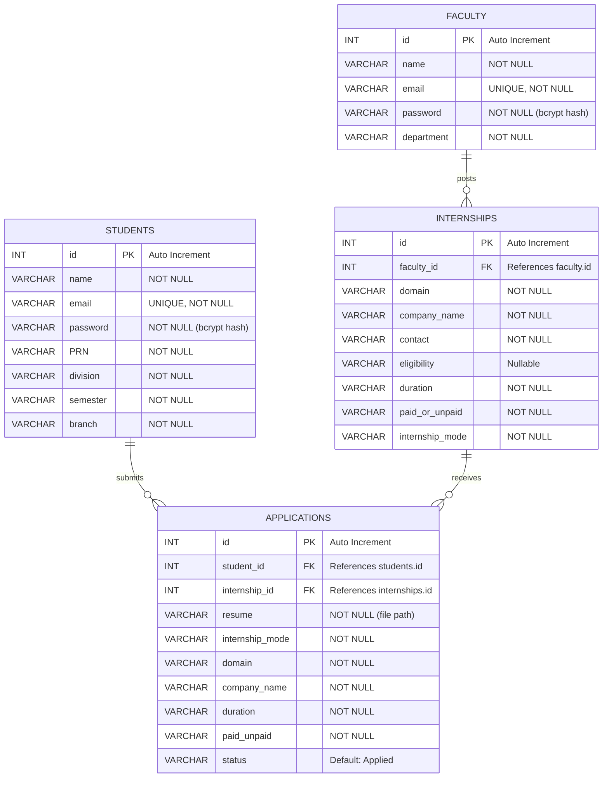
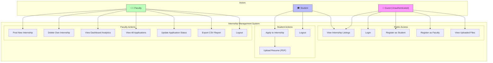
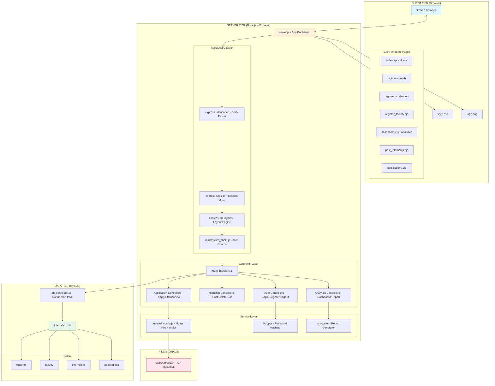
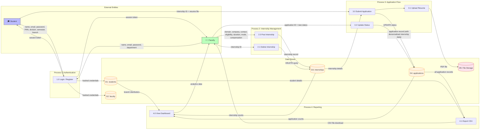

# 🎓 Internship Management Dashboard

A full-stack **Node.js + Express** web application for managing internship listings, student applications, and faculty analytics. Built with **EJS** templating, **MySQL** database, and role-based access control for **Students** and **Faculty**.

---

## 📋 Table of Contents

- [Tech Stack](#-tech-stack)
- [Project Structure](#-project-structure)
- [Core Modules](#-core-modules)
- [View Templates](#-view-templates-views)
- [Utility & Migration Scripts](#-utility--migration-scripts)
- [ER Diagram](#-er-diagram)
- [Use Case Diagram](#-use-case-diagram)
- [System Architecture Diagram](#-system-architecture-diagram)
- [Data Flow Diagram](#-data-flow-diagram)
- [API Routes](#-api-routes)
- [Setup & Installation](#-setup--installation)

---

## 🛠 Tech Stack

| Technology   | Purpose                        |
|--------------|--------------------------------|
| Node.js      | Server-side runtime            |
| Express.js   | Web framework & routing        |
| EJS          | Server-side HTML templating    |
| MySQL        | Relational database            |
| mysql2        | MySQL driver (Promise-based)  |
| bcryptjs     | Password hashing               |
| multer       | File upload handling (resumes) |
| csv-writer   | CSV report generation          |
| express-session | Session management          |
| express-ejs-layouts | Layout/template inheritance |

---

## 📁 Project Structure

```
intern/
├── server.js                 # App entry point — wires middleware & routes
├── database.js               # DB pool creation & schema initialization
├── db_connector.js           # Alternate DB connector with table bootstrapping
├── route_handlers.js         # All route controller logic (endpoints)
├── middleware_chain.js        # Auth guards & flash message middleware
├── upload_config.js          # Multer config for PDF resume uploads
├── seed_db.js                # Seeds database with sample data
├── migrate.js                # Drops & recreates all database tables
├── convert.js                # Converts Jinja2 HTML templates to EJS
├── cleanup_views.js          # Cleans residual Jinja2 syntax from EJS files
├── test_db.js                # Tests MySQL connection & creates database
├── package.json              # Project metadata & dependencies
├── internship_db_dump.sql    # Full MySQL database dump
├── internship_report.csv     # Generated CSV report output
├── requirements.txt          # Legacy Python dependencies reference
├── MAC_SETUP_INSTRUCTIONS.md # macOS-specific setup guide
├── views/                    # EJS templates (UI pages)
│   ├── layout.ejs            # Master layout template
│   ├── index.ejs             # Home page — internship listings
│   ├── login.ejs             # Login form
│   ├── register_student.ejs  # Student registration form
│   ├── register_faculty.ejs  # Faculty registration form
│   ├── dashboard.ejs         # Faculty analytics dashboard
│   ├── post_internship.ejs   # Create/manage internship listings
│   ├── applications.ejs      # View & manage student applications
│   ├── apply.ejs             # Student application form
│   └── add_student.ejs       # Add student form
└── static/
    ├── css/
    │   └── style.css         # Global stylesheet
    ├── assets/
    │   └── logo.png          # Application logo
    └── uploads/              # Uploaded resume PDFs (runtime)
```

---

## 🔧 Core Modules

### `server.js` — Application Entry Point

The main bootstrap file that initializes and configures the Express application.

**What it does:**
- Creates the Express app instance and sets up the listening port (`3000`)
- Registers body-parsing middleware (`urlencoded`, `json`)
- Configures session management with `express-session`
- Mounts the `/static` directory for serving CSS, images, and uploads
- Activates EJS as the view engine with layout support
- Injects flash message middleware globally
- Defines and maps all URL routes to their controller functions
- Applies role-based middleware guards to protected routes

**Key route groups:**
| Route Group | Access | Description |
|---|---|---|
| `/`, `/login` | Public | Home page & authentication |
| `/register/student`, `/register/faculty` | Public | User registration |
| `/post`, `/dashboard`, `/applications`, `/report` | Faculty only | Internship management & analytics |
| `/apply/:id` | Student only | Apply to internship with resume upload |
| `/logout` | Authenticated | Session termination |

---

### `database.js` — Database Pool & Schema Initialization

Manages the MySQL connection pool and auto-creates the database schema on startup.

**What it does:**
- Creates a MySQL connection pool using `mysql2/promise` with connection pooling (limit: 10)
- Connects to `internship_db` on `localhost`
- Defines and executes `CREATE TABLE IF NOT EXISTS` statements for all 4 tables
- Exports the pool for use by other modules

**Function:**
| Function | Description |
|---|---|
| `initDB()` | Async function that creates all database tables (`students`, `faculty`, `internships`, `applications`) if they don't exist. Called automatically on module load. |

---

### `db_connector.js` — Alternate Database Connector

An alternative database connection module with a Map-based configuration approach.

**What it does:**
- Builds connection config using JavaScript `Map` for key-value pairs
- Merges pool parameters (`waitForConnections`, `connectionLimit`, `queueLimit`)
- Defines table schemas as named pairs in `tableDefinitions` array
- Iterates through and creates all tables via `bootstrapSchema()`
- Exports the connection pool as `sqlLink`

**Function:**
| Function | Description |
|---|---|
| `bootstrapSchema()` | Async function that loops through `tableDefinitions` and creates each table. Logs success/failure for each table individually. |

> **Note:** This module is the one actively used by `route_handlers.js` (imported as `sqlLink`).

---

### `route_handlers.js` — Route Controllers

Contains **all** endpoint handler logic for the application. This is the largest module.

**What it does:**
- Implements all business logic for every route in the application
- Handles authentication, registration, CRUD operations, and reporting
- Uses `bcryptjs` for password hashing and verification
- Generates CSV reports using `csv-writer`

**Exported Functions (Controller Map):**

| Export Name | Internal Function | Description |
|---|---|---|
| `serveHomeListing` | `renderLandingPage` | Fetches all internships from DB and renders the home page |
| `serveLoginPage` | `renderSignInForm` | Renders the login form |
| `handleLoginSubmission` | `processCredentials` | Validates email/password, checks role (student/faculty), creates session |
| `serveLearnerSignupPage` | `renderPupilEnrollForm` | Renders the student registration form |
| `handleLearnerSignup` | `processPupilEnrollment` | Hashes password, inserts student record into DB |
| `serveInstructorSignupPage` | `renderProfessorEnrollForm` | Renders the faculty registration form |
| `handleInstructorSignup` | `processProfessorEnrollment` | Hashes password, inserts faculty record into DB |
| `handleSignOut` | `terminateSession` | Destroys session and redirects to home |
| `servePostingForm` | `renderOpportunityForm` | Shows internship creation form with existing listings |
| `handleNewPosting` | `processNewOpportunity` | Inserts new internship into DB |
| `handlePostingRemoval` | `removeOpportunity` | Deletes internship (only if owned by current faculty) |
| `handleApplicationSubmission` | `processApplication` | Validates resume upload, checks for duplicates, stores application |
| `serveDashboardView` | `renderAnalytics` | Gathers metrics and branch distribution for the dashboard |
| `serveApplicationsList` | `displaySubmissions` | Fetches all applications with student details (JOIN query) |
| `handleStatusChange` | `modifySubmissionStatus` | Updates an application's status (e.g., Applied → Completed) |
| `generateAndDownloadReport` | `exportToCsv` | Generates and downloads a CSV report of all applications |
| `serveUploadedFile` | `deliverUploadedFile` | Serves uploaded resume files from the uploads directory |

**Internal Helper Functions:**

| Function | Description |
|---|---|
| `locateAccount(tableName, emailAddr)` | Queries a given table (`students` or `faculty`) for a user by email |
| `verifySecret(plaintext, hashed)` | Compares a plaintext password against a bcrypt hash |
| `assembleMetricQueries()` | Returns an array of SQL count queries for dashboard analytics |
| `gatherMetrics()` | Executes all metric queries and returns counts (total apps, completed, paid/unpaid, online/offline) |
| `computeBranchDistribution()` | Queries distinct student branches and counts students per branch |

---

### `middleware_chain.js` — Middleware & Auth Guards

Provides Express middleware functions for authentication, authorization, and flash messages.

**Exported Functions:**

| Export Name | Internal Function | Description |
|---|---|---|
| `attachFlashLocals` | `injectAlertContext` | Reads `success`, `error`, `warning` from session, injects them into `res.locals` for templates, then clears them. Also injects `user` and `request` objects into locals. |
| `requireAuthentication` | `enforceAuthentication` | Redirects unauthenticated users to `/login` |
| `requireInstructorRole` | `enforceProfessorAccess` | Ensures user is logged in **and** has the `faculty` role. Redirects to `/` otherwise. |
| `requireLearnerRole` | `enforceStudentAccess` | Ensures user is logged in **and** has the `student` role. Redirects to `/` otherwise. |
| `setSessionNotice` | `storeAlert` | Utility to store a flash message (`success`/`error`/`warning`) in the session for display on the next page load. |

---

### `upload_config.js` — File Upload Configuration

Configures Multer for handling PDF resume uploads.

**What it does:**
- Sets the upload destination to `static/uploads/`
- Auto-creates the upload directory if it doesn't exist
- Generates unique filenames using the pattern: `student_{userId}_internship_{internshipId}_{originalFilename}`
- Restricts uploads to **PDF files only** (validates MIME type)

**Functions:**

| Function | Description |
|---|---|
| `composeFilename(ctx, doc, doneCb)` | Builds a unique filename from the user's session ID, internship ID, and original filename |
| `validateMimeType(_ctx, doc, doneCb)` | Checks that the uploaded file has `application/pdf` MIME type; rejects all others |

**Exports:**
- `fileUploader` — The configured Multer instance (used as `fileHandling.fileUploader.single('resume')` in routes)
- `assetUploadDir` — The absolute path to the uploads directory

---

## 📄 View Templates (`views/`)

All views use **EJS** templating with a shared layout.

| Template | Description |
|---|---|
| `layout.ejs` | **Master layout** — contains the HTML shell, navbar, flash message display, and footer. All other pages are rendered inside this layout. |
| `index.ejs` | **Home page** — displays all available internship listings in a card/table format. Students can apply directly from this page. |
| `login.ejs` | **Login page** — form with email, password, and role selector (student/faculty). |
| `register_student.ejs` | **Student registration** — collects name, email, password, PRN, division, semester, and branch. |
| `register_faculty.ejs` | **Faculty registration** — collects name, email, password, and department. |
| `dashboard.ejs` | **Faculty dashboard** — displays analytics: total/completed applications, paid/unpaid counts, online/offline stats, and a branch-wise distribution chart. |
| `post_internship.ejs` | **Internship posting** — form for faculty to create new internship listings (domain, company, contact, eligibility, duration, compensation, mode). Also shows existing listings with delete option. |
| `applications.ejs` | **Applications management** — table of all student applications with status update controls (faculty view). |
| `apply.ejs` | **Application form** — student-facing form to apply for an internship. |
| `add_student.ejs` | **Add student** — form to manually add a student record. |

---

## 🔨 Utility & Migration Scripts

### `seed_db.js` — Database Seeder

Populates the database with **35 sample records** of real-world internship data.

**What it does:**
- Creates a default faculty member if none exists
- Inserts sample internship listings from companies (DRDO, ARAI, Brose India, IVC Ventures, etc.)
- Creates student accounts with randomized PRN, semester, branch, and division values
- Generates corresponding application records with `Completed` status
- Caches company→internship mappings to avoid duplicate internship entries

**Run:** `node seed_db.js`

---

### `migrate.js` — Database Migration (Reset)

Drops all existing tables and triggers their recreation.

**What it does:**
- Disables foreign key checks
- Drops `applications`, `internships`, `students`, and `faculty` tables
- Re-enables foreign key checks
- Tables are recreated automatically when `database.js` is required

**Run:** `node migrate.js`

> ⚠️ **Warning:** This will **delete all data** in the database.

---

### `convert.js` — Template Converter (Jinja2 → EJS)

One-time migration utility that converts Python/Flask Jinja2 templates to EJS format.

**Conversions performed:**
- `{{ var }}` → `<%= var %>`
- `` → `<% for(let x of y) { %>`
- `` → `<% if (condition) { %>`
- `url_for('static', filename='...')` → `/static/...`
- Removes ``, ``, `` directives

**Run:** `node convert.js`

---

### `cleanup_views.js` — Post-Conversion Cleanup

Removes residual Jinja2 syntax artifacts left after the template conversion.

**What it does:**
- Strips leftover `<%- include("base") %>` calls
- Removes any remaining `` and `` tags

**Run:** `node cleanup_views.js`

---

### `test_db.js` — Database Connection Tester

Quick diagnostic script to verify MySQL connectivity.

**What it does:**
- Attempts to connect to MySQL on `localhost` as `root`
- Creates the `internship_db` database if it doesn't exist
- Prints `SUCCESS!` or the error message
- Exits with code `0` (success) or `1` (failure)

**Run:** `node test_db.js`

---

## 📊 ER Diagram

Entity-Relationship diagram showing all entities, their attributes, primary keys (PK), foreign keys (FK), and relationships.



**Relationship Summary:**

| Relationship | Cardinality | Constraint |
|---|---|---|
| Faculty → Internships | One-to-Many | A faculty member can post many internships |
| Students → Applications | One-to-Many | A student can submit many applications |
| Internships → Applications | One-to-Many | An internship can receive many applications |
| All Foreign Keys | — | `ON DELETE CASCADE` |

---

## 👤 Use Case Diagram

Shows all actors (Student, Faculty, Guest) and their interactions with the system.



**Use Case Descriptions:**

| # | Use Case | Actor | Description |
|---|---|---|---|
| UC1 | View Internship Listings | Guest, Student | Browse all available internship postings on the home page |
| UC2 | Login | Guest | Authenticate with email, password, and role selection |
| UC3 | Register as Student | Guest | Create student account with PRN, semester, branch details |
| UC4 | Register as Faculty | Guest | Create faculty account with department info |
| UC5 | View Uploaded Files | Guest | Access uploaded resume documents via URL |
| UC6 | Apply to Internship | Student | Submit an application for a specific internship |
| UC7 | Upload Resume | Student | Attach a PDF resume file with the application |
| UC8 | Logout | Student | End session and return to home page |
| UC9 | Post New Internship | Faculty | Create a new internship listing with all details |
| UC10 | Delete Own Internship | Faculty | Remove an internship that the faculty member posted |
| UC11 | View Dashboard | Faculty | See analytics: counts, paid/unpaid, online/offline, branch stats |
| UC12 | View Applications | Faculty | See all student applications with details |
| UC13 | Update App Status | Faculty | Change application status (Applied → Completed, etc.) |
| UC14 | Export CSV Report | Faculty | Download all application data as a CSV file |
| UC15 | Logout | Faculty | End session and return to home page |

---

## 🏗 System Architecture Diagram

Three-tier architecture showing the Client, Server, and Database layers with all components.



**Architecture Layers:**

| Layer | Component | Technology | Responsibility |
|---|---|---|---|
| **Client** | Browser | HTML/CSS/JS | Renders EJS templates, user interaction |
| **Middleware** | Body Parser | express.urlencoded | Parses form data from POST requests |
| **Middleware** | Session Manager | express-session | Maintains user sessions with cookies |
| **Middleware** | Auth Guards | middleware_chain.js | Role-based access control (student/faculty) |
| **Controller** | Route Handlers | route_handlers.js | Business logic for all 18 routes |
| **Service** | File Uploader | upload_config.js (Multer) | PDF resume upload, validation, storage |
| **Service** | Password Hasher | bcryptjs | Secure password hashing (10 salt rounds) |
| **Service** | Report Generator | csv-writer | CSV export of application data |
| **Data** | DB Connector | db_connector.js (mysql2) | MySQL connection pooling (limit: 10) |
| **Data** | Database | MySQL | Persistent storage of all application data |
| **Storage** | File System | static/uploads/ | Uploaded resume PDF files |

---

## 🔄 Data Flow Diagram

Shows how data flows through the system for key operations.



**Key Data Flows:**

| Flow | From | To | Data |
|---|---|---|---|
| **Student Registration** | Student → System → `students` table | Stores name, email, hashed password, PRN, division, semester, branch |
| **Faculty Registration** | Faculty → System → `faculty` table | Stores name, email, hashed password, department |
| **Login** | User → System | Validates credentials, creates session with `{id, name, role}` |
| **Post Internship** | Faculty → System → `internships` table | Stores domain, company, contact, eligibility, duration, mode, pay type |
| **Apply** | Student → System → `applications` table + File Storage | Validates no duplicate, copies internship details (denormalized), saves PDF resume |
| **Update Status** | Faculty → System → `applications` table | Changes status field (Applied / Completed / Rejected, etc.) |
| **Dashboard** | `applications` + `internships` + `students` → System → Faculty | Aggregated counts: total, completed, paid/unpaid, online/offline, branch stats |
| **CSV Export** | `applications` + `students` → System → Faculty | Downloads CSV with application ID, student name, branch, semester, company, duration, mode, paid, status |

---

## 🌐 API Routes

| Method | Route | Auth | Handler | Description |
|--------|-------|------|---------|-------------|
| GET | `/` | Public | `serveHomeListing` | Home page with internship listings |
| GET | `/login` | Public | `serveLoginPage` | Login form |
| POST | `/login` | Public | `handleLoginSubmission` | Authenticate user |
| GET | `/register/student` | Public | `serveLearnerSignupPage` | Student registration form |
| POST | `/register/student` | Public | `handleLearnerSignup` | Create student account |
| GET | `/register/faculty` | Public | `serveInstructorSignupPage` | Faculty registration form |
| POST | `/register/faculty` | Public | `handleInstructorSignup` | Create faculty account |
| GET | `/logout` | Any | `handleSignOut` | Destroy session |
| GET | `/post` | Faculty | `servePostingForm` | Internship creation form |
| POST | `/post` | Faculty | `handleNewPosting` | Create new internship |
| POST | `/delete_internship/:id` | Faculty | `handlePostingRemoval` | Delete owned internship |
| GET | `/dashboard` | Faculty | `serveDashboardView` | Analytics dashboard |
| GET | `/applications` | Faculty | `serveApplicationsList` | View all applications |
| POST | `/applications/:id/update_status` | Faculty | `handleStatusChange` | Update application status |
| GET | `/report` | Faculty | `generateAndDownloadReport` | Download CSV report |
| POST | `/apply/:id` | Student | `handleApplicationSubmission` | Submit application + resume |
| GET | `/uploads/:filename` | Public | `serveUploadedFile` | Serve uploaded files |

---

## 🚀 Setup & Installation

### Prerequisites
- **Node.js** (v16+)
- **MySQL** (v8.0+)

### Steps

1. **Clone the repository & navigate to the project:**
   ```bash
   cd intern
   ```

2. **Install dependencies:**
   ```bash
   npm install
   ```

3. **Set up the database:**
   ```bash
   # Test MySQL connection & create database
   node test_db.js

   # (Optional) Reset database tables
   node migrate.js
   ```

4. **Seed sample data (optional):**
   ```bash
   node seed_db.js
   ```

5. **Start the server:**
   ```bash
   npm start
   ```

6. **Open in browser:**
   ```
   http://localhost:3000
   ```

### Default Database Configuration
| Setting  | Value          |
|----------|----------------|
| Host     | `localhost`    |
| User     | `root`         |
| Password | `admin1234`    |
| Database | `internship_db`|
| Port     | `3306` (default) |

> To change credentials, update `db_connector.js` and `database.js`.

---

## 📄 Other Files

| File | Description |
|---|---|
| `internship_db_dump.sql` | Full MySQL dump of the database schema and data — can be imported to restore the database |
| `internship_report.csv` | Sample CSV report output generated by the `/report` endpoint |
| `requirements.txt` | Legacy Python dependencies from the original Flask version (no longer used) |
| `MAC_SETUP_INSTRUCTIONS.md` | Step-by-step guide for setting up the project on macOS |
| `static/css/style.css` | Global CSS stylesheet for all pages |
| `static/assets/logo.png` | Application logo image |
| `static/uploads/` | Runtime directory where uploaded PDF resumes are stored |

---

*Built with using Node.js & Express*
